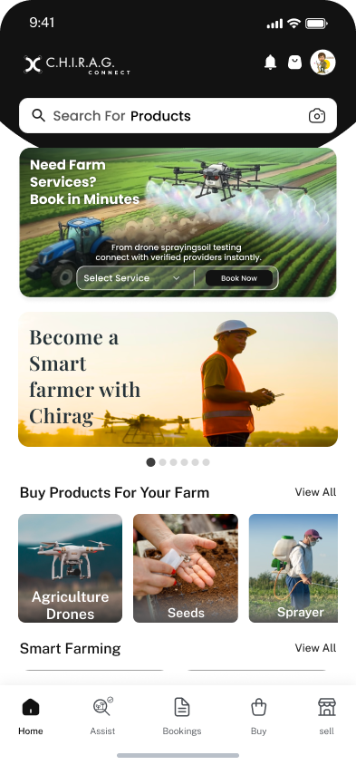
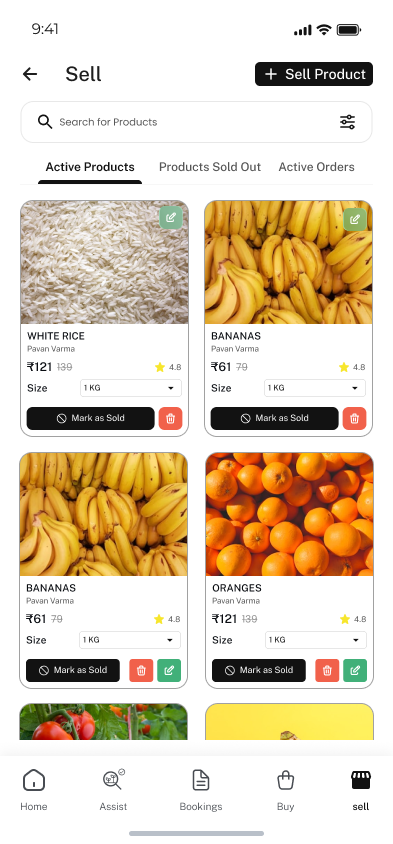
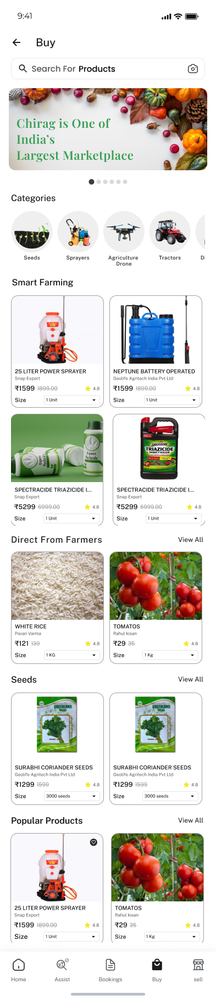

# Chirag Farmer

Android app for farmers to buy/sell agricultural supplies, book drone spraying services, and get AI-powered crop advisory. Basically trying to bring the whole farming ecosystem into one app.

## Why I built it

I grew up seeing how tough farming is in India...middlemen take most of the profit, finding quality supplies is a hassle, and when a crop gets sick most people don't know what to do till its too late. Wanted to build somthing that actually helps instead of just being another e-commerce clone.

Originally it started as a basic marketplace app. But then farmers using it started asking for things like "can I talk to someone about my crop disease" and "can I book a drone to spray my fields"...so I kept adding features. Now its a full fledged platform.

## How I built it

Started with a simple MVP, just a product listing with cart and orders. But as the scope grew I realised I needed proper architecture otherwise this thing was gonna turn into spagetti code real fast. Went with Clean Architecture + MVVM because it makes adding new features way less painfull. Each feature is isolated so if somthings broken in bookings it doesnt effect the marketplace.

The backend is Node.js + Express with MongoDB (separate repo). Initially I was making direct API calls from the app but then added a proper repository layer with caching so the app works decently even on slow networks...which is important because a lot of users are in areas with patchy connectivity.

Added Razorpay payments because UPI and cards are huge in India, Cloudinary for image handling, OSM for maps (google maps api is expensive), and later integrated AI for crop disease detection using image analysis.

## What's in it

- **Marketplace:** Browse/search products by category, seller profiles, product details with reviews
- **Shopping Cart:** Add/remove items, quantity management, buy now flow
- **Orders:** Place orders, track status, cancel items, order history
- **Payments:** Razorpay (Card/UPI/Wallet) + Cash on Delivery
- **AI Crop Advisory:** Chat with AI assistant for farming advice, upload crop photos for disease detection, get remedy recommendations in Hindi/Punjabi/Telugu
- **Service Booking:** Schedule drone spraying services with location and farm area selection
- **Authentication:** Phone OTP via MSG91, profile management, business info setup
- **Notifications:** FCM push notifications for order updates and alerts
- **Multi-lingual:** English, Hindi, Punjabi, Telugu because language shouldn't be a barrier
- **Dark/light theme:** Follows system but you can toggle

## Built with

Kotlin, Jetpack Compose, Material 3, Clean Architecture, Hilt DI, Retrofit2, Room, DataStore, Paging 3, Coil, Firebase (FCM + Crashlytics), Sentry, Razorpay, Cloudinary, OpenStreetMap, Hashids.

## Screenshots

<p align="center">
  
  
  
</p>

## Running locally

```bash
./gradlew assembleDebug
```

You need to set up `local.properties` with API keys (see the build file for whats required). The backend repo is separate so you'll need that running too unless you point to prod (which I wouldnt recomend for testing).

```properties
# local.properties
OSM_NOMINATIM_BASE_URL=https://nominatim.openstreetmap.org/
CLOUD_NAME=your_cloud_name
CLOUDINARY_UPLOAD_PRESET=your_preset
HASHIDS_SALT=your_salt
SENTRY_DSN=your_dsn
```
