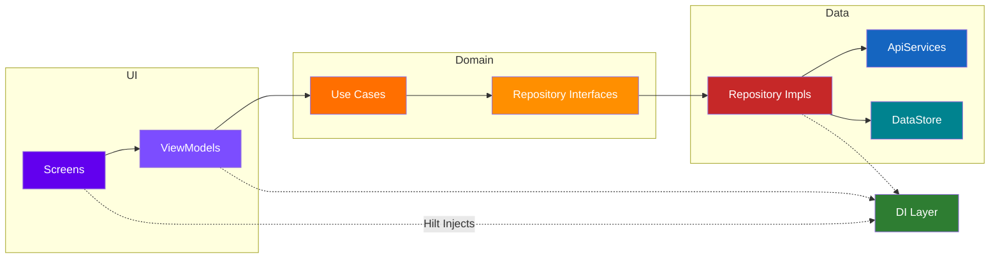
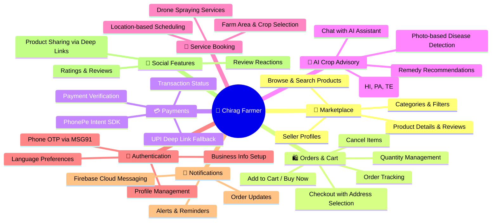
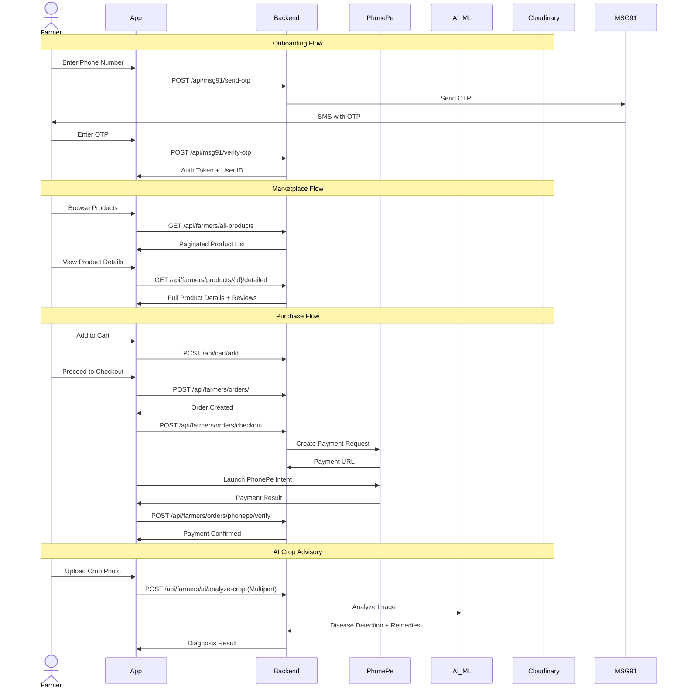
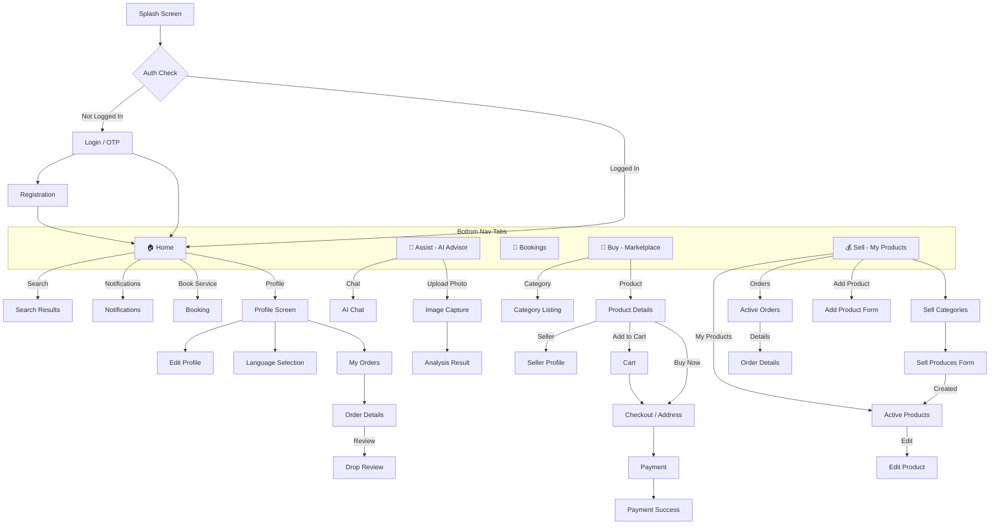
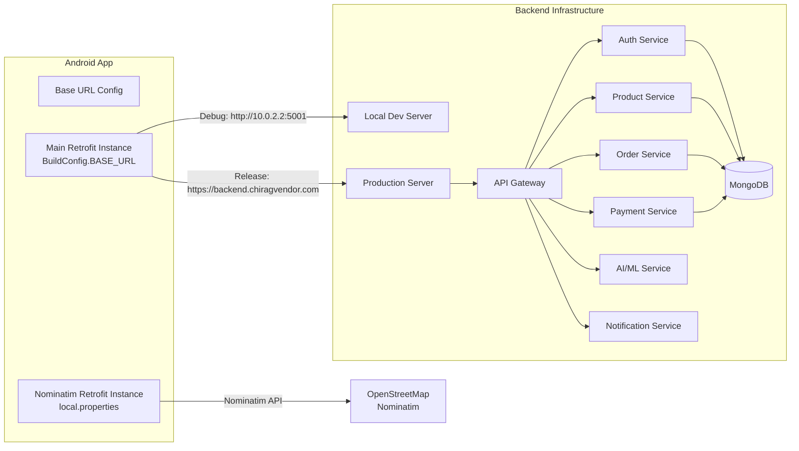
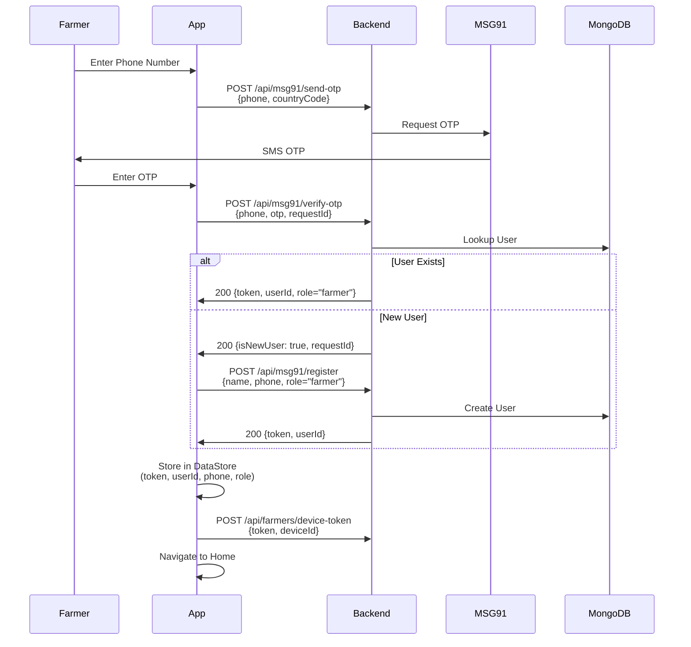
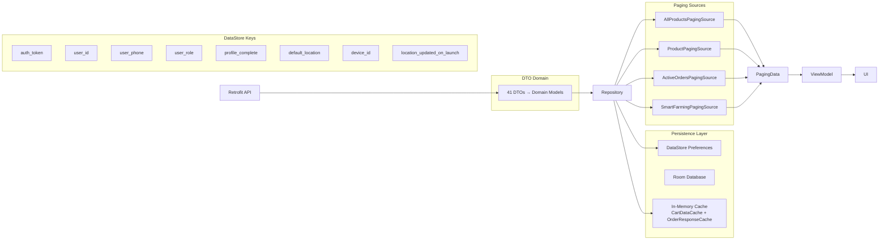
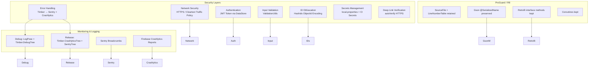

# 🌾 Chirag Farmer

<p align="center">
  
  
  
  
  
  
  
  
  
</p>

> **An enterprise-grade agricultural e-commerce marketplace & AI-powered crop advisory platform** — bridging farmers with modern digital tools for buying/selling supplies, AI-driven crop diagnostics, and agricultural service booking.

---

## 📋 Table of Contents

- [System Architecture](#-system-architecture)
- [Feature Overview](#-feature-overview)
- [Navigation & Routing](#-navigation--routing)
- [Tech Stack](#-tech-stack)
- [API Layer](#-api-layer)
- [Data Architecture](#-data-architecture)
- [Security Architecture](#-security-architecture)
- [CI/CD Pipeline](#-cicd-pipeline)
- [Build & Configuration](#-build--configuration)
- [Project Structure](#-project-structure)
- [Contributing](#-contributing)
- [License](#-license)

---

## 🏗 System Architecture

The application follows **Clean Architecture** with three distinct layers, enforcing strict dependency inversion and separation of concerns.

```mermaid
graph TB
    subgraph "UI Layer (Presentation)"
        C[Compose Screens<br/>Composables]
        VM[ViewModels<br/>@HiltViewModel]
        NA[Navigation<br/>NavHost + Route Sealed Class]
    end

    subgraph "Domain Layer (Business Logic)"
        UC[Use Cases<br/>32 Use Cases]
        DI[Domain Interfaces<br/>Repository Contracts]
        DM[Domain Models<br/>Product, Order, Location]
    end

    subgraph "Data Layer (Implementation)"
        RI[Repository Implementations<br/>8 Repositories]
        RD[Remote Data Sources<br/>8 Retrofit ApiServices]
        LD[Local Data Sources<br/>DataStore + Room]
        PG[Paging 3 Sources<br/>4 PagingSource]
    end

    subgraph "DI Layer (Hilt)"
        HILT[Hilt Modules<br/>NetworkModule, ApiModule,<br/>RepositoryModule, DataStoreModule,<br/>FirebaseModule, BookingModule, LocationModule]
    end

    subgraph "External Services"
        API["🌐 Backend API<br/>backend.chiragvendor.com"]
        FCM["🔥 Firebase<br/>Cloud Messaging"]
        PH["💳 PhonePe<br/>Payment Gateway"]
        CLD["☁️ Cloudinary<br/>Image Hosting"]
        OSM["🗺 OpenStreetMap<br/>Nominatim"]
        MSG["📱 MSG91<br/>OTP Service"]
        SNT["📊 Sentry<br/>Error Monitoring"]
        CRL["🛡 Firebase<br/>Crashlytics"]
    end

    C --> VM
    VM --> UC
    UC --> DI
    DI --> RI
    RI --> RD
    RI --> LD
    RI --> PG
    HILT --- VM
    HILT --- RI
    HILT --- RD
    RD --> API
    RD --> OSM
    RI --> PH

    LD -->|DataStore| APP[App Preferences]
    PG -->|Paging| API

    subgraph "Cloud Infrastructure"
        API -->|"Node.js/Express"| BE[Backend Services]
        BE --> DB[(MongoDB)]
        BE --> AI["🧠 AI ML Engine<br/>Crop Analysis + Chat"]
    end

    CLD --- API
    MSG --- API
    FCM --> SNT
    FCM --> CRL

    style C fill:#6200EE,color:#fff,stroke:#333,stroke-width:2px
    style UC fill:#FF6F00,color:#fff,stroke:#333,stroke-width:2px
    style API fill:#1565C0,color:#fff,stroke:#333,stroke-width:2px
    style HILT fill:#2E7D32,color:#fff,stroke:#333,stroke-width:2px
    style RI fill:#C62828,color:#fff,stroke:#333,stroke-width:2px
```

### Dependency Flow



---

## 🌟 Feature Overview



### Feature Interaction Flow



---

## 🧭 Navigation & Routing



### Route Map

```
Route sealed class hierarchy:

Route
├── splash
├── auth
├── otp/{phone}/{requestId}/{isSignUp}
├── register
├── register_success
├── home (5 bottom nav tabs)
├── search
├── buy_category/{categoryName}
├── productdetails/{productId}
├── cart?isBuyNow=&productId=&quantity=
├── address_map
├── address
├── payment?subtotal=&discount=&fee=&total=
├── payment_success
├── profile
├── edit_profile
├── language
├── orders
├── order_details/{orderId}?productId=
├── seller_profile/{sellerId}&sellerName=&sellerImage=
├── drop_review/{orderId}?productId=&imageUrl=&name=
├── notifications
├── assist
├── assist_image
├── plant_problem_help
├── assist_result?imageUri=&language=
├── bookings
├── sell
├── sell_categories
├── sell_product?productId=&selectedCategory=
├── order_status/{orderId}
└── seller_order_details/{orderId}

Deep Links:
  https://backend.chiragvendor.com/share/product/{id}  → productdetails
  https://backend.chiragvendor.com/share/farmer/{id}   → seller_profile
  https://backend.chiragvendor.com/share/seller/{id}   → seller_profile
  chirag://app/{type}/{id}                              → (fallback)
```

---

## 🛠 Tech Stack

### Core Stack

| Category | Technology | Version | Purpose |
|---|---|---|---|
| **Language** | Kotlin | 2.0+ | Primary development language |
| **UI Framework** | Jetpack Compose | BOM 2024.09.00 | Declarative UI |
| **Design System** | Material 3 | — | Modern Material Design |
| **Architecture** | Clean Architecture | — | 3-layer separation of concerns |
| **DI** | Hilt (Dagger) | 2.51.1 | Dependency injection |
| **Navigation** | Navigation Compose | 2.9.5 | Declarative navigation |
| **Async** | Kotlin Coroutines + Flow | — | Async operations |
| **Paging** | Paging 3 | 3.2.1 | Paginated data loading |

### Networking & Data

| Technology | Version | Purpose |
|---|---|---|
| Retrofit 2 | 2.9.0 | HTTP client for REST APIs |
| OkHttp 3 | 4.11.0 | HTTP engine + interceptor chain |
| Gson | — | JSON serialization/deserialization |
| LogPose | — | Network request/response logging |
| Room | 2.6.1 | Local persistence (SQLite) |
| DataStore Prefs | 1.1.7 | Key-value preferences |
| Coil | 2.6.0 | Image loading/caching |
| Shimmer | 1.3.3 | Loading skeleton effects |

### Cloud & Services

| Service | SDK/Library | Purpose |
|---|---|---|
| **Firebase** | messaging:25.0.1 | Push notifications (FCM) |
| **Firebase** | crashlytics-ktx:19.4.0 | Crash reporting |
| **Sentry** | sentry-android:8.24.0 | Error monitoring + breadcrumbs |
| **PhonePe** | IntentSDK:5.3.2 | In-app UPI payments |
| **Cloudinary** | android-core:3.1.2 | Image upload and CDN hosting |
| **OpenStreetMap** | osmdroid:6.1.18 | Map display for address selection |
| **Nominatim** | REST API | Geocoding / location search |
| **MSG91** | REST API | Phone OTP authentication |
| **Google Play** | review:2.0.2 | In-app review prompt |

### Backend Integration



---

## 📡 API Layer

### API Service Interfaces

| Interface | Endpoints | Purpose |
|---|---|---|
| `AuthApiService` | 17 | OTP, registration, profile, addresses, device tokens |
| `ProductApiService` | 16 | CRUD products, search, categories, reviews, ratings |
| `CartApiService` | 5 | Add/remove/update cart, buy-now, get cart |
| `OrderApiService` | 8 | Place/cancel/track orders, update status |
| `PhonePeApiService` | 3 | Checkout, verify payment, payment status |
| `NotificationApiService` | 1 | Fetch user notifications |
| `CropAnalysisApiService` | 1 | AI crop image analysis (multipart) |
| `ChatApiService` | 1 | AI chat conversation |
| `BookingApiService` | 1 | Create service booking |
| `LocationApi` | 1 | Nominatim place search |

### Authentication Flow



---

## 💾 Data Architecture

### State Management



### Key Domain Models

| Model | Key Fields | Mapped From |
|---|---|---|
| `Product` | productId, name, imageUrl, sellerName, effectivePrice, qty, originalPrice, rating | `ProductDetailedDto`, `ProductDto` |
| `Order` | orderObjectId, orderId, productName, image, buyerInfo, qty, amount, status | `OrderDto`, `OrderDetailsDto` |
| `OrdersData` | orders: List\<Order\>, total, page, limit, totalPages | `UserPlacedOrdersDto` |
| `Location` | displayName, latitude, longitude | `LocationDto` |
| `BookingRequest` | latitude, longitude, serviceType, farmArea, cropName | `BookingDto` |

---

## 🔒 Security Architecture



### Security Measures Detail

| Category | Implementation |
|---|---|
| **Object ID Security** | Hashids library with configurable salt encodes MongoDB ObjectIds in share links, preventing sequential enumeration attacks |
| **Device Identity** | `Settings.Secure.ANDROID_ID` with UUID fallback |
| **Certificate Pinning** | Cleartext traffic allowed for dev; production enforced via HTTPS (`backend.chiragvendor.com`) |
| **Payment Security** | PhonePe Intent SDK handles UPI; verification via server-side callback |
| **Secrets** | All API keys, salts, merchant IDs in `local.properties` (`.gitignore`d); CI uses GitHub Secrets |
| **Monitoring** | Dual error tracking: Sentry breadcrumbs + Firebase Crashlytics |
| **Logging** | Zero-overhead in release builds; debug builds use LogPose + HTTP logging interceptor |

---

## 🔄 CI/CD Pipeline

```mermaid
flowchart LR
    DEV[Develop<br/>main branch] -->|PR| TEST[Test / Validate]
    TEST -->|Merge| DEPLOY[deployment branch]
    DEPLOY --> GHA[GitHub Actions Trigger]

    subgraph "GitHub Actions Workflow"
        GHA --> CHECKOUT[Checkout Code]
        CHECKOUT --> JAVA[Setup Java 17]
        JAVA --> SECRETS[Inject Secrets<br/>local.properties]
        SECRETS --> KEYSTORE[Decode Keystore<br/>Base64 → release.keystore]
        KEYSTORE --> BUILD[Build<br/>./gradlew bundleRelease]
        BUILD --> SIGN[Sign APK/AAB<br/>Release Keystore]
        SIGN --> ARTIFACT[Upload Artifact<br/>app-release.aab]
    end

    ARTIFACT -->|Manual| PLAY[Google Play Console<br/>Internal Testing]
    PLAY --> PROD[Production Release]

    style GHA fill:#1565C0,color:#fff
    style BUILD fill:#2E7D32,color:#fff
    style SIGN fill:#FF6F00,color:#fff
    style PLAY fill:#6200EE,color:#fff
```



### CI/CD Config (`.github/workflows/android-release.yml`)

| Step | Action | Details |
|---|---|---|
| **Trigger** | Push to `deployment` | Branch-based deployment |
| **Java** | actions/setup-java@v4 | Temurin JDK 17 |
| **Secrets** | Environment variables | 6 secrets injected |
| **Keystore** | Base64 decode | `RELEASE_STORE_FILE` → `release.keystore` |
| **Build** | `./gradlew bundleRelease` | Full release build |
| **Signing** | Env vars | Store password, key alias, key password |
| **Artifact** | Upload | `app/build/outputs/bundle/release/app-release.aab` |

---

## 🔧 Build & Configuration

### Prerequisites

- Android Studio Ladybug+
- Android SDK 36
- JDK 17+
- Kotlin 2.0+

### `local.properties` (Required)

```properties
# Backend & Services
OSM_NOMINATIM_BASE_URL=https://nominator.openstreetmap.org/
CLOUD_NAME=your_cloudinary_cloud_name
CLOUDINARY_UPLOAD_PRESET=your_upload_preset

# Payments
PHONEPE_MERCHANT_ID=your_phonepe_merchant_id

# Security
HASHIDS_SALT=your_hashids_salt
```

### Build Variants

| Variant | Base URL | Logging | ProGuard |
|---|---|---|---|
| **Debug** | `http://10.0.2.2:5001/` | LogPose + HTTP Logging | Disabled |
| **Release** | `https://backend.chiragvendor.com/` | Crashlytics + Sentry | Disabled* |

> \* ProGuard is currently disabled in release config (`isMinifyEnabled = false`). To enable, uncomment in `app/build.gradle.kts`.

### Key Dependencies (`app/build.gradle.kts`)

```kotlin
// Core
implementation("androidx.compose:compose-bom:2024.09.00")
implementation("androidx.navigation:navigation-compose:2.9.5")
implementation("com.google.dagger:hilt-android:2.51.1")
kapt("com.google.dagger:hilt-compiler:2.51.1")

// Network
implementation("com.squareup.retrofit2:retrofit:2.9.0")
implementation("com.squareup.okhttp3:logging-interceptor:4.11.0")

// Database
implementation("androidx.room:room-runtime:2.6.1")
implementation("androidx.datastore:datastore-preferences:1.1.7")

// Image Loading
implementation("io.coil-kt:coil-compose:2.6.0")

// Payments
implementation("phonepe.intentsdk.android.release:IntentSDK:5.3.2")

// Cloud
implementation("com.cloudinary:cloudinary-android-core:3.1.2")

// Firebase
implementation(platform("com.google.firebase:firebase-bom:33.12.0"))
implementation("com.google.firebase:firebase-messaging:25.0.1")
implementation("com.google.firebase:firebase-crashlytics-ktx:19.4.0")

// Error Monitoring
implementation("io.sentry:sentry-android:8.24.0")

// Paging
implementation("androidx.paging:paging-runtime:3.2.1")
implementation("androidx.paging:paging-compose:3.2.1")
```

---

## 📁 Project Structure

```
com.yash091099.ChiragFarmersApp/
│
├── ChiragFarmerApplication.kt          # @HiltAndroidApp entry point
│
├── data/
│   ├── local/ChiragDataStore.kt        # DataStore preferences
│   ├── model/auth/                     # Auth request/response DTOs (8 files)
│   ├── paging/                         # PagingSource (4 files)
│   ├── remote/
│   │   ├── *ApiService.kt              # Retrofit interfaces (10 files)
│   │   └── dto/                        # Data transfer objects (41 files)
│   ├── repository/                     # Repository implementations (9 files)
│   ├── CartDataCache.kt
│   └── OrderResponseCache.kt
│
├── domain/
│   ├── model/                          # Domain models (4 files)
│   ├── repository/                     # Repository interfaces (8 files)
│   └── usecase/                        # Business logic use cases (32 files)
│
├── di/
│   ├── ApiModule.kt                    # Retrofit API service providers
│   ├── BookingModule.kt                # Booking DI
│   ├── DataStoreModule.kt              # DataStore provider
│   ├── FirebaseModule.kt               # Crashlytics + Messaging
│   ├── LocationModule.kt               # Nominatim API DI
│   ├── NetworkModule.kt                # OkHttp + Retrofit + Logging
│   └── RepositoryModule.kt             # Repository bindings
│
├── services/
│   └── ChiragMessagingService.kt       # FCM push notification handler
│
├── ui/
│   ├── theme/                          # Color, Type, Theme composables
│   └── presentation/
│       ├── assist/                     # AI crop advisory feature
│       ├── auth/                       # Login, OTP, Registration
│       ├── bookings/                   # Service booking
│       ├── buy/                        # Marketplace browsing
│       ├── cart/                       # Shopping cart + checkout
│       ├── checkout/                   # Checkout screen
│       ├── common/                     # Shared components
│       ├── home/                       # Dashboard, search, notifications
│       ├── mainactivity/MainActivity.kt
│       ├── navigation/                 # Routes, NavHost, NavBar
│       ├── orders/                     # Order management
│       ├── payment/                    # Payment extras
│       ├── profile/                    # User profile & settings
│       ├── sell/                       # Product listing & order mgmt
│       └── splash/                     # Splash screen + location
│
└── utils/
    ├── AmountFormatter.kt
    ├── Base64ImageUtils.kt
    ├── CloudinaryUploader.kt
    ├── Constants.kt
    ├── dashedBorder.kt
    ├── DeviceIdProvider.kt
    ├── NetworkErrorUtil.kt
    ├── ShareUtils.kt                   # Hashids deep link sharing
    ├── ValidationUtils.kt
    └── logging/
        ├── CrashlyticsTree.kt          # Timber → FirebaseCrashlytics
        └── SentryTree.kt               # Timber → Sentry breadcrumbs
```

### Package Counts

| Layer | Packages | Files |
|---|---|---|
| **Data** | 5 | ~65 |
| **Domain** | 3 | ~44 |
| **DI** | 1 | 7 |
| **UI** | 14+ | ~80+ |
| **Services** | 1 | 1 |
| **Utils** | 1 | 10 |

---

## 🤝 Contributing

1. Fork the repository
2. Create a feature branch (`git checkout -b feature/amazing-feature`)
3. Commit your changes (`git commit -m 'feat: add amazing feature'`)
4. Push to the branch (`git push origin feature/amazing-feature`)
5. Open a Pull Request

### Commit Convention

We follow [Conventional Commits](https://www.conventionalcommits.org/):
- `feat:` — New feature
- `fix:` — Bug fix
- `refactor:` — Code change without feature/fix
- `docs:` — Documentation only
- `chore:` — Build/config changes
- `test:` — Adding tests

---

## 📄 License

**Private project** — All rights reserved. © 2025 Chirag Farmer.

---

<p align="center">
  <i>Built with 🌾 for the farming community</i><br/>
  <a href="https://backend.chiragvendor.com/">Backend</a> ·
  <a href="https://sentry.io/">Sentry</a> ·
  <a href="https://console.firebase.google.com/">Firebase</a>
</p>
